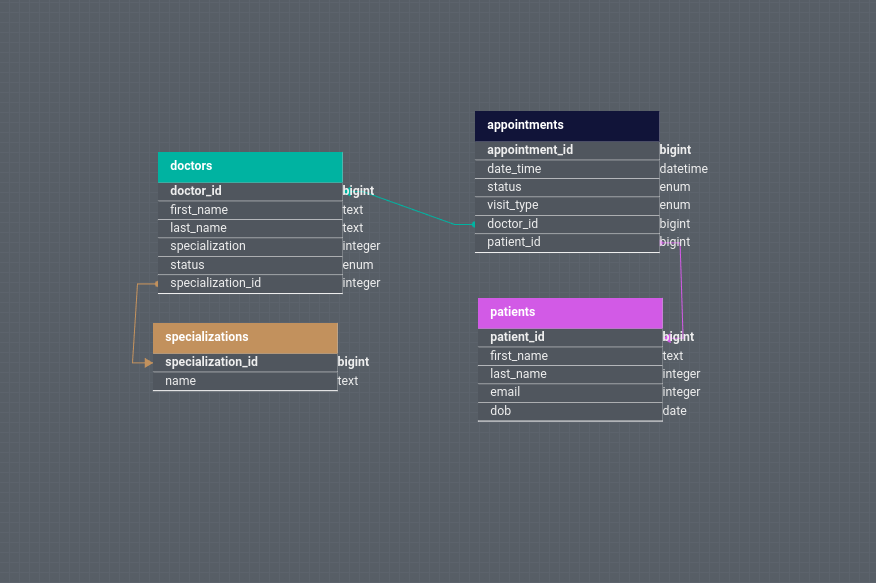

# Medical Booking Web Application

## Description

This is a full-stack **Medical Portal** built using **Java Spring Boot** for the backend, **React.js** for the frontend, and **PostgreSQL** for the database. The portal allows patients to book appointments with doctors, and provides an administrator interface to manage doctors in the system. **Okta** is used for secure administrator authentication, and the entire application is containerized using **Docker** and orchestrated with **Docker Compose**.

## Features
- **Patient Appointment Booking**: Patients can view available doctors, book appointments, and view, edit, and cancel existing appointments.
- **Doctor Management (Admin)**: Admin users can add, update, or delete doctor records in the system.
- **Okta Authentication**: Secure administrator login **Okta**.
- **CRUD Operations**: Create, read, update, and delete appointments and doctor records.
- **PostgreSQL Database**: Data is managed in a PostgreSQL database.
- **Containerization**: The backend, frontend, and database are all containerized with Docker and managed using Docker Compose.

## Tech Stack
- **Backend**: Java, Spring Boot
- **Frontend**: React.js
- **Database**: PostgreSQL
- **Authentication**: Okta (OAuth 2.0 / OpenID Connect)
- **API Design**: RESTful
- **Containerization**: Docker, Docker Compose
- **ORM**: Spring Data JPA (Hibernate)

## Installation Instructions

### Prerequisites
Before getting started, make sure you have the following installed:
- **Docker**: [Install Docker](https://www.docker.com/get-started)
- **Docker Compose**: [Install Docker Compose](https://docs.docker.com/compose/install/)
- **Okta Account**: [Sign up for Okta](https://developer.okta.com/signup) to get your API credentials.

### 1. Clone the repository
```bash
git clone https://github.com/York-Solutions-B2E/tsg-10-med-booking-james-odonnell.git
cd tsg-10-med-booking-james-odonnell
```

### 2. Configuration
- Rename the example.env.yml to match the env_file in the docker-compose.yml file
- Set your Okta provided issuer, client-id, and client-secret environment variables in .env.yml
- Set your PostgreSQL environment variables in the same file, these can be whatever you want

### 3. Build the project
```bash
docker-compose up --build
```

## Additional Docker commands

### Stop running docker-compose containers
```bash
docker-compose down
```
### List all running/available containers
```bash
#All running containers
docker ps
#All available containers
docker ps -a
```
### Start/Stop individual containers
```bash
docker start <container-name>
docker stop <container-name>
```

## Database Schema


## Seed Data

### Specializations
```json
[
    {
        "id": 1,
        "name": "Cardiology"
    },
    {
        "id": 2,
        "name": "Pediatrics"
    },
    {
        "id": 3,
        "name": "Dermatology"
    },
    {
        "id": 4,
        "name": "Orthopedics"
    },
    {
        "id": 5,
        "name": "Neurology"
    }
]
```

### Patients
```json
[
	{
		"id": 1,
		"firstName": "Joseph",
		"lastName": "O'Donnell",
		"email": "joedonn@hotmail.com",
		"dob": "2018-05-05T11:50:00",
	},
	{
		"id": 2,
		"firstName": "Kelly",
		"lastName": "Flannigan",
		"email": "kflanners69@yahoo.com",
		"dob": "2018-05-05T11:50:00",
	},
	{
		"id": 3,
		"firstName": "Jeremy",
		"lastName": "Wimmer",
		"email": "jwimmmmmm@hotmail.com",
		"dob": "2018-05-05T11:50:00",
	},
	{
		"id": 4,
		"firstName": "Doulas",
		"lastName": "Wilson",
		"email": "douglaswouglas@gmail.com",
		"dob": "2018-05-05T11:50:00",
	},
	{
		"id": 5,
		"firstName": "John",
		"lastName": "Smith",
		"email": "johnnysmiffy@proton.me",
		"dob": "2018-05-05T11:50:00",
	},
]
```

### Doctors
Each doctor has a randomized specialization
```json
[
  {
    "id": 1,
    "firstName": "George",
    "lastName": "McGregor",
    "status": "ACTIVE",
  },
  {
    "id": 2,
    "firstName": "Ashton",
    "lastName": "Balder",
    "status": "ACTIVE",
  },
  {
    "id": 3,
    "firstName": "Grace",
    "lastName": "Whittaker",
    "status": "ACTIVE",
  },
  {
    "id": 4,
    "firstName": "Franklin",
    "lastName": "Howitt",
    "status": "ACTIVE",
  },
  {
    "id": 5,
    "firstName": "Martin",
    "lastName": "Shelton",
    "status": "ACTIVE",
  },
  {
    "id": 6,
    "firstName": "Isaac",
    "lastName": "Jones",
    "status": "ACTIVE",
  },
  {
    "id": 7,
    "firstName": "Adam",
    "lastName": "Cook",
    "status": "ACTIVE",
  },
  {
    "id": 8,
    "firstName": "Catherine",
    "lastName": "Barksdale",
    "status": "ACTIVE",
  },
  {
    "id": 9,
    "firstName": "Barbara",
    "lastName": "Robertson",
    "status": "ACTIVE",
  },
  {
    "id": 10,
    "firstName": "Walter",
    "lastName": "Kennedy",
    "status": "ACTIVE",
  },
  {
    "id": 11,
    "firstName": "Fredrick",
    "lastName": "Johnson",
    "status": "ACTIVE",
  },
  {
    "id": 12,
    "firstName": "James",
    "lastName": "Holden",
    "status": "ACTIVE",
  },
  {
    "id": 13,
    "firstName": "Timothy",
    "lastName": "Ryan",
    "status": "ACTIVE",
  },
  {
    "id": 14,
    "firstName": "Cole",
    "lastName": "Hill",
    "status": "ACTIVE",
  },
  {
    "id": 15,
    "firstName": "Crawford",
    "lastName": "Lawritz",
    "status": "ACTIVE",
  },
  {
    "id": 16,
    "firstName": "Savanah",
    "lastName": "Cross",
    "status": "ACTIVE",
  },
  {
    "id": 17,
    "firstName": "Jennifer",
    "lastName": "Rossman",
    "status": "ACTIVE",
  },
  {
    "id": 18,
    "firstName": "Kamille",
    "lastName": "Beasley",
    "status": "ACTIVE",
  }
  {
    "id": 19,
    "firstName": "Aaron",
    "lastName": "Nakano",
    "status": "ACTIVE",
  }
  {
    "id": 20,
    "firstName": "Kay",
    "lastName": "Simmons",
    "status": "ACTIVE",
  }
]
```